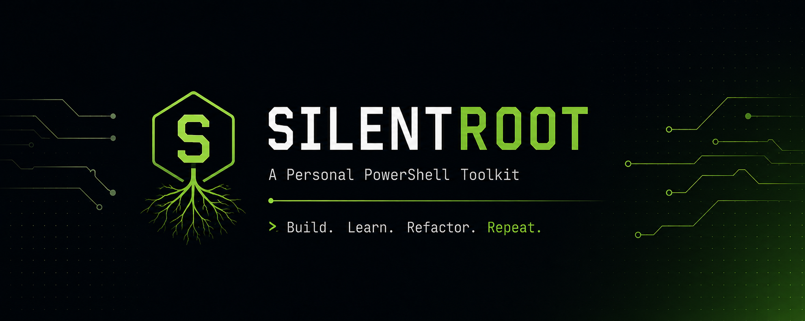

<p align="center">
  
</p>

<p align="center">


</p>

---

# SilentRoot

> **A modular PowerShell environment built for productivity, automation, and continuous learning.**

SilentRoot is my personal PowerShell environment where I build tools that simplify my daily workflow.

Instead of creating one large framework, this project grows one utility at a time. Every module exists because I needed it, wanted to learn something new, or simply enjoyed building it.

This repository is primarily a **personal learning and hobby project**. It is **not intended to become a commercial product or production framework.**

---

# Philosophy

SilentRoot is built around a few simple ideas.

- Build tools for real problems.
- Keep code readable and maintainable.
- Learn by building.
- Document everything.
- Refactor continuously.

> **Build. Learn. Refactor. Repeat.**

---

# Design Goals

The long-term direction of SilentRoot is guided by these principles.

- Simplicity over complexity
- Consistency across modules
- Self-documenting commands
- Modular architecture
- A clean and enjoyable command-line experience

---

# Features

Current features include:

- Modular PowerShell profile
- Markdown-based Help System
- Help metadata parser
- Automatic Help index generation
- Help topic templates
- Browser shortcuts
- Git helpers
- Central configuration loader
- Modular project architecture
- Easy to extend

---

# Installation

Clone the repository.

```powershell
git clone https://github.com/MX-phantom/SilentRoot.git

cd SilentRoot
```

Configure your PowerShell profile and import the modules that fit your workflow.

> Installation instructions will continue to evolve alongside the project.

---

# Project Structure

```text
SilentRoot
│
├── Assets/
├── Core/
├── Docs/
├── HelpData/
├── Modules/
├── Tests/
│
├── Microsoft.PowerShell_profile.ps1
├── README.md
└── LICENSE
```

---

# Documentation

Documentation is written alongside the project.

Every command includes its own Markdown help file inside the **HelpData** directory.

Examples:

```powershell
Help

Help Browser

Help Git
```

---

# Roadmap

## Completed

- [x] Modular project structure
- [x] Help metadata parser
- [x] Help index builder
- [x] Help topic generator
- [x] Markdown help system
- [x] Browser module

## In Progress

- [ ] Help command
- [ ] Search command
- [ ] Better help formatting
- [ ] Interactive help

## Planned

- [ ] Plugin system
- [ ] Theme manager
- [ ] Package manager
- [ ] Auto updater
- [ ] Rich terminal interface

---

# Project Status

🚧 **Active Development**

Current priorities:

- Help System
- Documentation
- Search Engine
- Module Architecture

---

# Why SilentRoot?

SilentRoot isn't about creating hundreds of commands.

It's about building the **right tools** — small, well-documented utilities that remain useful, maintainable, and enjoyable to work on over time.

---

# Contributing

Although this is primarily a personal learning project, suggestions, ideas, and discussions are always welcome.

If you'd like to contribute:

- Open an issue before major changes.
- Keep pull requests focused.
- Follow PowerShell best practices.
- Write clear documentation.

---

# License

Released under the MIT License.

See the **LICENSE** file for details.

---

<p align="center">

**Build. Learn. Refactor. Repeat.**

</p>
